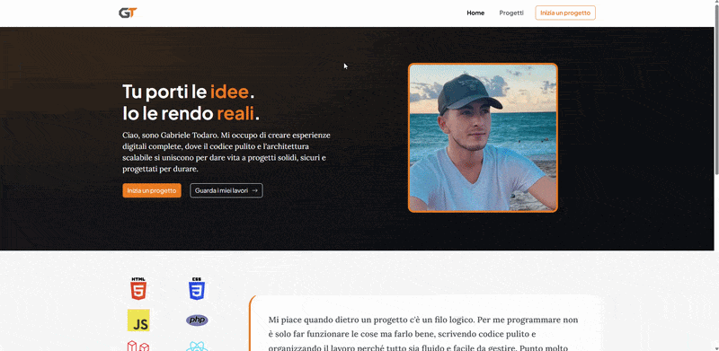

# Portfolio 

Portfolio personale sviluppato come evoluzione di un progetto inizialmente locale, trasformato in una web app fullstack con **React**, **TypeScript** e **Supabase**. Il sito espone i dati gestiti da backend cloud, con deploy su **Cloudflare Pages** e collegamento al dominio personale **[gabrieletodaro-dev.it](https://gabrieletodaro-dev.it)**.

# Demo 

### Tecnologie utilizzate

* **React**
* **TypeScript**
* **Vite**
* **Supabase**
* **Bootstrap**
* **Bootstrap Icons**
* **Web3Forms**
* **Cloudflare Pages**
